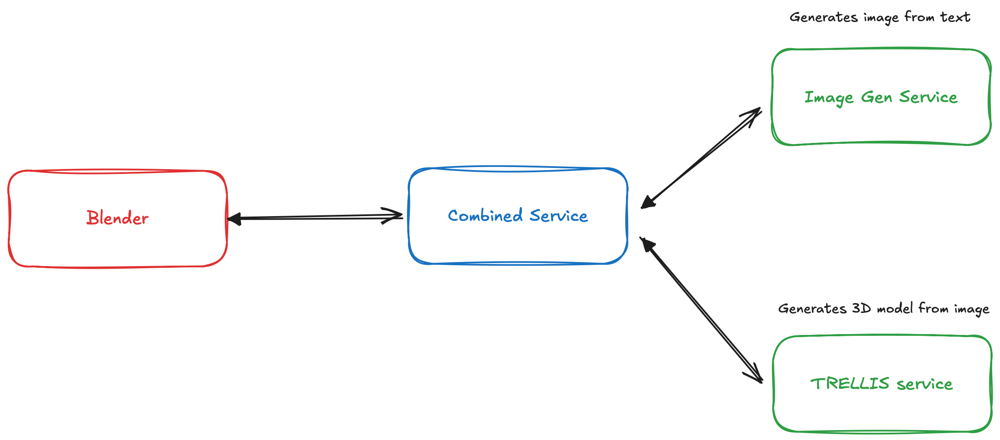

# Text to 3D Generation System with TRELLIS

This project provides an end-to-end solution for generating 3D models from text descriptions, combining image generation and 3D model creation. It includes a FastAPI service, a Blender addon, and Docker support.

It leverages [TRELLIS](https://trellis3d.github.io) to generate 3D models from images, and FLUX with LoRAs to generate images from text.

## Tutorial

Setup steps explained in detail:
https://youtu.be/8tGpDRHKxGI

## Components

- **Combined Service**: A FastAPI server that orchestrates the generation process
- **Serverless Version**: A service that uses RunPod serverless endpoints
- **Blender Addon**: A plugin for Blender that provides a user interface for the generation system
- **Docker Support**: Containerization for easy deployment

## Prerequisites

- Blender 3.0+
- Docker

## Project Structure

- `local_combined_service.py`: The main FastAPI server that orchestrates the generation process, using Docker-based services
- `runpod_combined_service.py`: The main FastAPI server that orchestrates the generation process, using RunPod serverless endpoints
- `text_to_3d_addon.py`: The Blender addon that provides a user interface for the generation system
- `Dockerfile`: The Dockerfile for the combined service
- `Dockerfile.runpod`: The Dockerfile for the combined service, using RunPod serverless endpoints
- `image-for-3d-gen`: The image generation service that uses FLUX with LoRAs
- `TRELLIS`: The 3D model generation module. It's a fork of the original TRELLIS repository, with some modifications to support RunPod and a better dockerized setup.




## How to Run

### Preliminary steps

1. Clone the repository
2. Initialize submodules: `git submodule update --init --recursive`

### Deploy the services

You need to first deploy the image-for-3d-gen and the TRELLIS services.
You can either deploy them locally, in the cloud (AWS, GCP, Azure, RunPod), or on RunPod Serverless.
There are Dockerfiles for both types of deployments. The RunPod serverless ones end with `.runpod`.

You can either build the images yourself, or use the pre-built ones, listed here:
- `image-for-3d-gen` for RunPod serverless: `albtaiuti/trellis-image-gen-runpod-serverless:v1.0`
- `image-for-3d-gen` for local (or cloud vm): `albtaiuti/blender-tools-image-for-3d-gen:v1.0`
- `TRELLIS` for RunPod serverless: `albtaiuti/trellis-headless-runpod:v1.0`
- `TRELLIS` for local (or cloud vm): `albtaiuti/trellis-headless:v1.0`

For TRELLIS, you need a GPU with at least 32GB of VRAM. Same for the image-for-3d-gen service.
I recommend using 48GB of VRAM for the image-for-3d-gen service, and 32GB for TRELLIS.

Take note of the endpoints of the services you deployed.

I chose RunPod serverless for the serverless version because it was easy to set it up and cheap, but you can probably slightly modify the code to use other serverless providers.

### Run the combined service

There are two versions of the combined service. One uses the RunPod serverless endpoints, and the other uses the local (i.e. FastAPI) endpoints.
Depending on your setup from above, you should choose the one that matches your setup. I.e. if you deployed the services on RunPod serverless, you should use the RunPod serverless version of the combined service.

1. Build the docker image: `docker build -f Dockerfile (or Dockerfile.runpod) -t text-to-3d-gen .`
2. Create an .env file in the root of the project with the following variables:
    If you are using the local version of the combined service:
    - `IMAGE_SERVICE_URL`: The URL of the image-for-3d-gen service, e.g.: `http://localhost:8001` or `https://589rxbmnmabclk-8000.proxy.runpod.net`, etc.
    - `MODEL_SERVICE_URL`: The URL of the TRELLIS service, e.g.: `http://localhost:8002` or `https://589rxbmnmabclh-8000.proxy.runpod.net`, etc.

    If you are using the RunPod serverless version of the combined service:
    - `RUNPOD_IMAGE_ENDPOINT_ID`: The endpoint ID of the image-for-3d-gen service
    - `RUNPOD_3D_ENDPOINT_ID`: The endpoint ID of the TRELLIS service
    - `RUNPOD_API_KEY`: The API key of your RunPod account

3. Run the docker image: `docker run -p 8000:8000 --env-file .env text-to-3d-gen`

At this point, you should be able to send a test POST request to the combined service to check if it's working:
```bash
curl --location 'http://localhost:8000/generate' \
--header 'Content-Type: application/json' \
--data '{
    "prompt": "an orange buggy car"
}'
```

and finally, once it's running, you can check the status of the job with:
```bash
curl --location 'http://localhost:8000/status/JOB_ID'
```

which will return a JSON with the status of the job:

```json
{
    "status": "completed",
    "image_base64": "base64_image_data",
    "model_base64": "base64_model_data",
    "error": null
}
```

If the job is still in progress, the status will be `generating_3d` or `generating_image`.
If the job failed, the status will be `failed` and the error will contain the error message.

## Blender Addon

The Blender addon is located in the `text_to_3d_addon.py` file.
It provides a user interface for the generation system, and allows you to generate 3D models from text.

To set it up, you need to install the `text_to_3d_addon` in Blender,
then use it to generate 3D models from text.

Once generated, they are automatically imported into Blender.

## License

See [LICENSE](LICENSE) for more details.
